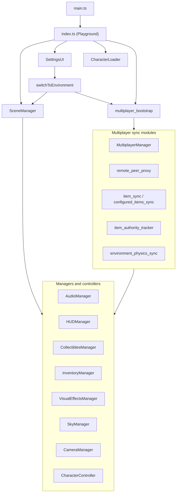

<p align="center">
  
</p>

<h1 align="center">Babylon Game Starter</h1>

<p align="center"><em>A modular, configuration-driven 3D game framework built with Babylon.js v9, TypeScript, and Vite.</em></p>

<p align="center">

[](https://github.com/EricEisaman/babylon-game-starter/releases)
[](https://ericeisaman.github.io/babylon-game-starter/)
[](https://github.com/EricEisaman/babylon-game-starter/actions/workflows/typecheck.yml)
[](https://www.babylonjs.com)
[](https://www.typescriptlang.org)
[](https://nodejs.org)
[](LICENSE)

</p>

Babylon Game Starter provides a complete, ready-to-run foundation for building interactive 3D browser games. It ships with physics-based character movement, an environment system, collectibles, inventory, a behavior trigger system (proximity and fall-out-of-map), particle effects, an AudioV2-powered sound engine, and full mobile control support — all driven by configuration files. The same client can be bundled for the **Babylon.js Playground** via `playground.json`.

**Current release: [v1.6.0](#v160)** — Installable PWA with unified branding, offline cache, and iPad Safari install coach.

**Live demo:** [https://ericeisaman.github.io/babylon-game-starter/](https://ericeisaman.github.io/babylon-game-starter/) (GitHub Pages — [EricEisaman/babylon-game-starter](https://github.com/EricEisaman/babylon-game-starter))

---

## v1.6.0 {#v160}

Released **May 2026**. Minor version: installable PWA, unified branding config, and Vite 8 upgrade; default game behavior is unchanged unless you use PWA or branding features.

### Added

- **Installable PWA** — `vite-plugin-pwa` with CacheFirst service worker, versioned updates, and offline asset caching via [`public/branding/config.json`](src/client/public/branding/config.json).
- **Settings PWA controls** — **Update App**, **Install App** (context-aware: native prompt on Chromium, Share → Add to Home Screen coach on iPad Safari), and **Purge Cache**.
- **Branding docs and scripts** — [BRANDING.md](BRANDING.md), `npm run generate:pwa-assets`, and `npm run pwa:test` (manifest + preview installability validation).
- **Playground-safe PWA bridge** — [`src/client/utils/pwa_runtime.ts`](src/client/utils/pwa_runtime.ts) keeps `playground.json` free of service-worker imports.

### Fixed

- **Install UX** — Modal copy and behavior adapt to device context (iPad Safari coach vs Chromium native install prompt).

### Changed

- **Vite 8** — Build toolchain upgraded to Vite ^8.0.14; Node engines `>=20.19.0 || >=22.12.0`; CI uses Node 22.

To ship this line of work to deployment branches, follow [FEATURE_RELEASE.md](FEATURE_RELEASE.md) (`feature/**` tag or manual sync workflow).

---

## v1.5.0 {#v150}

Released **May 2026**. Minor version: new optional simulation content and playground fixes; default worlds and multiplayer wire format are unchanged unless you opt in.

### Added

- **SynapticLab** — Optional simulation environment ported from [circuit-hijack](https://github.com/EricEisaman/circuit-hijack): HUD meters (D1, D2, RPE, hunger, coupling, habit), volume zones, and collectibles (Dopamine Proxy crystals, PFC Exercise crate). Enable with [`?sim=1`](http://localhost:3000/?sim=1) or `CONFIG.SIMULATION.ENABLED`. See [docs/SYNAPTIC_LAB.md](docs/SYNAPTIC_LAB.md).
- **`OverlayManager`** — Catalog-driven **DOM/CSS overlays** (e.g. Drug Hunger Vignette on SynapticLab). Dev override: `?overlay=<catalog name>`.
- **`simulation/` modules** — `simulation_bootstrap`, `StateSimulationManager`, and typed simulation config wired from behaviors and HUD.
- **Docs** — [docs/SYNAPTIC_LAB.md](docs/SYNAPTIC_LAB.md), [docs/AUTHORING_SNIPPETS.md](docs/AUTHORING_SNIPPETS.md), and [docs/evaluation/](docs/evaluation/) (circuit-hijack evaluation notes).

### Fixed

- **Playground export** — AudioV2 uses explicit `audioEngine` imports (no `No audio engine` from dual-module `BABYLON.CreateSoundAsync`). Draco decoder URLs and audio pre-init in `index.ts` `CreateScene`. Particle catalog `snippetId` values point at real Babylon snippets (no 404s for Smoke Trail / Nebula Cloud). Collectibles spawn even when collection audio is unavailable.
- **Settings UI** — Environment dropdown stays in sync after programmatic env switches (`?sim=1`, portals, multiplayer).
- **Playground TypeScript** — `import.meta.env` reads are playground-safe in `dev_log` and `datastar_client` (no `ImportMetaEnv` compile errors in the web editor).

### Changed

- **CI** — Typecheck workflow also runs on pushes to `feature/**` branches (in addition to `main` and pull requests).

To ship this line of work to deployment branches, follow [FEATURE_RELEASE.md](FEATURE_RELEASE.md) (`feature/**` tag or manual sync workflow).

---

## Features

- **Modular manager architecture** — Scene, camera, audio, HUD, collectibles, inventory, behaviors, visual effects, sky, cutscenes, character loading, and more
- **Configuration-driven design** — Characters, environments, items, sounds, and rules through typed config under `src/client/config/`
- **Babylon.js v9 AudioV2** — Background music with crossfading, ambient positional sounds, and SFX; playground export passes an explicit audio engine (see [PLAYGROUND.md](PLAYGROUND.md))
- **Optional state simulation** — SynapticLab demo with `?sim=1`, behavior-driven meter updates, and DOM overlays
- **Physics-based movement** — Havok integration for character movement, jumping, and boost
- **Environment system** — Switchable 3D worlds with music, particles, items, sky, overlays, optional fall-respawn hooks
- **Collectibles and inventory** — Pickup, credits, inventory, and temporary item effects
- **Behavior system** — Proximity triggers, fall-out-of-world respawn, glow, `adjustCredits`, and environment `portal` actions
- **HUD** — Device-adaptive layout (desktop / mobile / iPad + keyboard) from `game_config.ts`
- **Mobile controls** — Virtual joystick, jump, and boost
- **Playground export** — `npm run export:playground` produces `playground.json` for the Babylon.js web editor, **including multiplayer**. The export is smoke-checked by `scripts/check-playground-export.mjs` before it is written. See [*Running in the Babylon playground*](MULTIPLAYER.md#running-in-the-babylon-playground) for the classroom walkthrough, including the `?mp=host` runtime override.
- **Installable PWA** — Offline-first asset caching, unified branding config, and install screenshots; see [BRANDING.md](BRANDING.md). Validate with `npm run pwa:test`.

---

## Tech stack

| Package             | Version |
| ------------------- | ------- |
| `@babylonjs/core`   | ^9.1.0  |
| `@babylonjs/gui`    | ^9.1.0  |
| `@babylonjs/havok`  | ^1.3.12 |
| `@babylonjs/loaders`| ^9.1.0  |
| `@babylonjs/materials` | ^9.1.0 |
| `vite`              | ^8.0.14 |
| `typescript`        | ^5.3.3  |

---

## Quick start

```sh
npm install
npm run dev
```

Open [http://localhost:3000](http://localhost:3000) in your browser.

### Optional extensions (dev)

The default game is unchanged. To try the optional **SynapticLab** simulation demo (ported from [circuit-hijack](https://github.com/EricEisaman/circuit-hijack)):

| URL | Effect |
|-----|--------|
| [`http://localhost:3000/?sim=1`](http://localhost:3000/?sim=1) | Enables state simulation, loads **SynapticLab**, HUD meters, DOM hunger vignette — see [docs/SYNAPTIC_LAB.md](docs/SYNAPTIC_LAB.md) |
| `?overlay=Drug%20Hunger%20Vignette` | Dev: force an overlay catalog entry (use with `?sim=1`) |

Or set `CONFIG.SIMULATION.ENABLED: true` in [`src/client/config/game_config.ts`](src/client/config/game_config.ts) and switch to **SynapticLab** in Settings.

See [docs/SYNAPTIC_LAB.md](docs/SYNAPTIC_LAB.md), [docs/AUTHORING_SNIPPETS.md](docs/AUTHORING_SNIPPETS.md), and [docs/evaluation/README.md](docs/evaluation/README.md).

**Multiplayer (local):** run `npm run dev:fullstack` to start Vite and the Go API together (Go restarts automatically when you save `src/server/multiplayer/**` — see `nodemon.multiplayer.json`). Or use two terminals: `npm run dev:multiplayer` then `npm run dev`. With `VITE_MULTIPLAYER_HOST` unset, the client uses same-origin `/api/multiplayer/*`, proxied to Go (see `vite.config.ts`). Override the backend with `.env.local` — see `.env.example`.

---

## Scripts

| Command                     | Description                                                                 |
| --------------------------- | ----------------------------------------------------------------------------- |
| `npm run dev`               | Vite dev server (client root `src/client/`)                                 |
| `npm run dev:multiplayer`   | Go multiplayer on `:5000`, **restarts on `.go` / `go.mod` / `go.sum` changes** (nodemon) |
| `npm run dev:multiplayer:once` | One-shot `go run` (no file watcher)                                    |
| `npm run dev:fullstack`     | Watched Go API + Vite (`-k` stops both if one exits)                         |
| `npm run build`             | Production build to `dist/`                                                 |
| `npm run preview`           | Preview the production build                                                  |
| `npm run format`            | Prettier write on `src/**/*.ts`, `eslint.config.js`, `vite.config.ts`         |
| `npm run format:check`      | Prettier check (runs in CI)                                                   |
| `npm run lint`              | ESLint (runs in CI)                                                           |
| `npm run lint:fix`          | ESLint with `--fix`                                                           |
| `npm run typecheck`         | `tsc --noEmit` for app and Node configs (runs in CI)                        |
| `npm run export:playground` | Generate `playground.json` for the Babylon.js editor and smoke-check it     |
| `npm run check:playground`  | Re-run the export smoke check standalone (walks every import from the entry)|
| `npm run generate:pwa-assets` | Regenerate PWA icons and install screenshots from branding source art |
| `npm run pwa:test`          | Build and validate full PWA installability (manifest + Lighthouse audits) |
| `npm run deploy:prepare`    | Validate deployment settings and scaffold host artifacts / `src/server/*`   |

CI (`.github/workflows/typecheck.yml`) runs **`format:check` → `lint` → `typecheck`**.

---

## Project structure

```text
src/client/
  config/              # assets.ts, game_config.ts, input_keys.ts, mobile_controls.ts,
                       # character_states.ts, local_dev.ts
  controllers/         # Character, camera, animation
  input/               # Mobile touch input
  managers/            # scene_manager, audio_manager, overlay_manager,
                       # visual_effects_manager, behavior_manager, fall_respawn_hooks,
                       # collectibles_manager, inventory_manager, hud_manager, …
  simulation/          # simulation_bootstrap, state_simulation_manager (optional ?sim=1 demo)
  types/               # Shared TypeScript types
  ui/                  # Settings, inventory, HUD-related UI
  utils/               # switch_environment.ts, dev helpers, notifications, …
  index.ts             # Playground-style entry (CreateScene)
  main.ts              # Vite bootstrap (engine, audio globals, Havok)
  index.html
src/deployment/        # Typed settings, prepare-deployment, runtime install plan
src/server/            # Per-service folders (scaffolded from deployment settings)
scripts/
  generate-playground-json.mjs
src/client/public/playground.json   # Written by export:playground
src/client/playground/playground.json   # Second copy for playground bundle
vite.config.ts         # Reads deployment settings; dev proxy to local services
eslint.config.js
```

---

## Documentation

- **[BRANDING.md](BRANDING.md)** — Loading screen, favicon, and PWA manifest/icons/screenshots via `public/branding/config.json`
- **[docs/SYNAPTIC_LAB.md](docs/SYNAPTIC_LAB.md)** — `?sim=1`, SynapticLab gameplay, overlays, and playground testing
- **[docs/AUTHORING_SNIPPETS.md](docs/AUTHORING_SNIPPETS.md)** — Particle, NME, and overlay catalog authoring
- **[USERS_GUIDE.md](USERS_GUIDE.md)** — Architecture, configuration, behaviors, fall respawn, condensed narrative notes
- **[MULTIPLAYER.md](MULTIPLAYER.md)** — Multiplayer onboarding, configuration, testing, and troubleshooting
- **[MULTIPLAYER_SYNCH.md](MULTIPLAYER_SYNCH.md)** — Normative wire contract, authority rules, and item-sync spec
- **[PLAYGROUND.md](PLAYGROUND.md)** — Contributor guide for code that ships inside `playground.json` (ambient `BABYLON` global, static-imports-only rule, smoke-checker guardrails, export pipeline)
- **[SERIALIZATION_GUIDE.md](SERIALIZATION_GUIDE.md)** — State serialization, deserialization, and mesh application
- **[SERIALIZATION_QUICK_REF.md](SERIALIZATION_QUICK_REF.md)** — Cheat-sheet for the serialization helpers
- **[src/deployment/DEPLOYMENT.md](src/deployment/DEPLOYMENT.md)** — Settings-driven deploy, Docker, host artifacts
- **[NETLIFY_STATIC_SITE_DEPLOYMENT.md](NETLIFY_STATIC_SITE_DEPLOYMENT.md)** — Static Netlify deployment and multiplayer configuration
- **[GITHUB_PAGES_STATIC_SITE_DEPLOYMENT.md](GITHUB_PAGES_STATIC_SITE_DEPLOYMENT.md)** — Static GitHub Pages deployment and multiplayer configuration
- **[FORK_GITHUB_SETUP.md](FORK_GITHUB_SETUP.md)** — One-time GitHub settings after you fork (Pages, Actions, `gh-deploy`)
- **[FEATURE_RELEASE.md](FEATURE_RELEASE.md)** — Example: `assets.ts` change, feature branch, `feature/**` tag, and sync PRs to `main` plus deployment branches
- **[RENDER_DEPLOYMENT.md](RENDER_DEPLOYMENT.md)** — Production deploy on Render.com
- **[STYLE.md](STYLE.md)** — TypeScript / ESLint / Prettier expectations for contributors
- **[CONTRIBUTING.md](CONTRIBUTING.md)** — Dev setup, PR workflow, commit conventions, and SemVer policy

---

## Bootstrap (high level)


